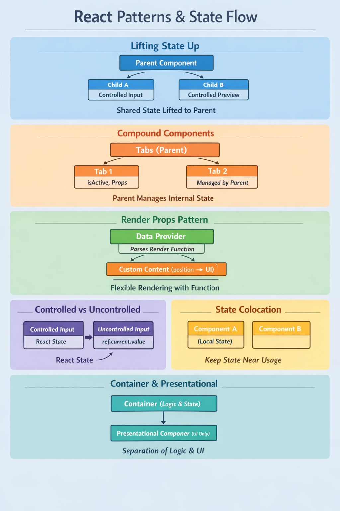
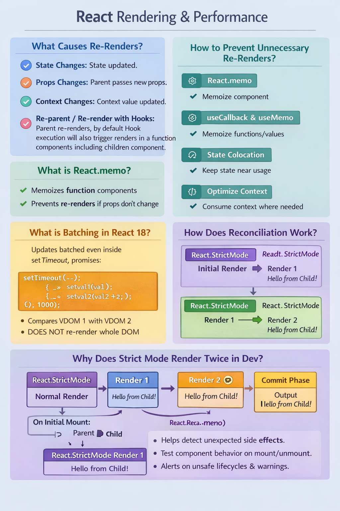
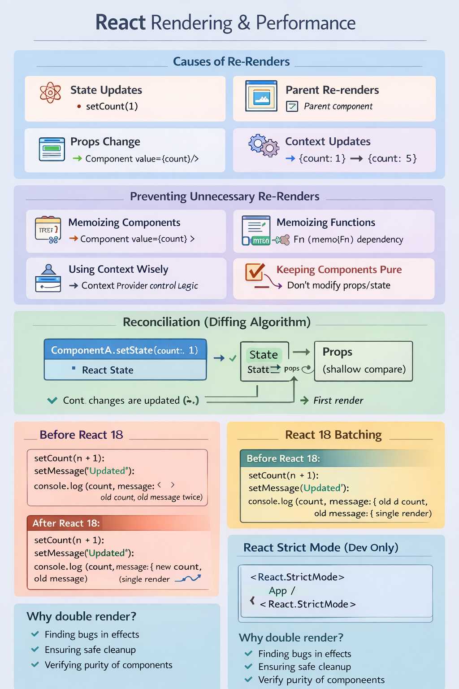
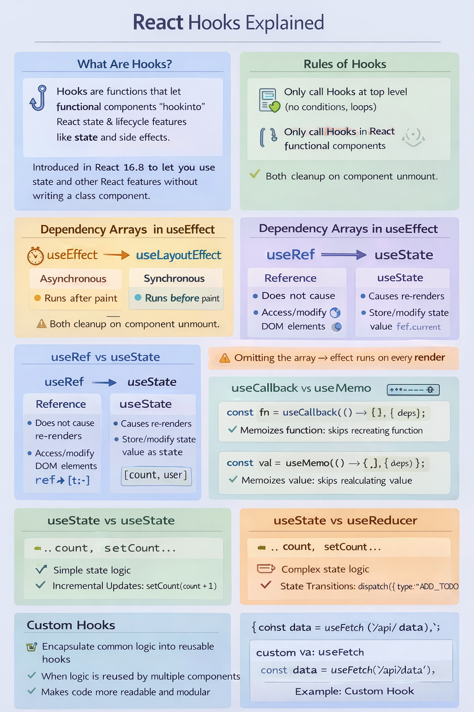
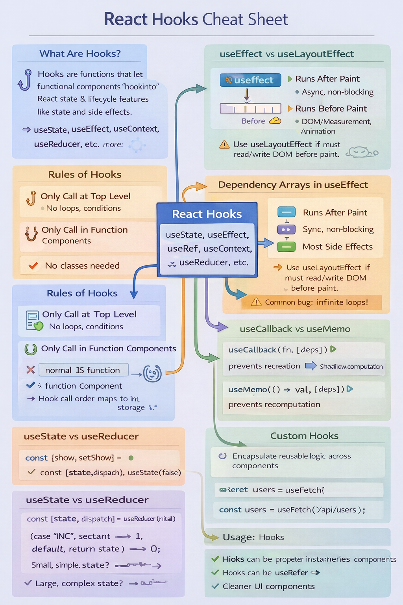
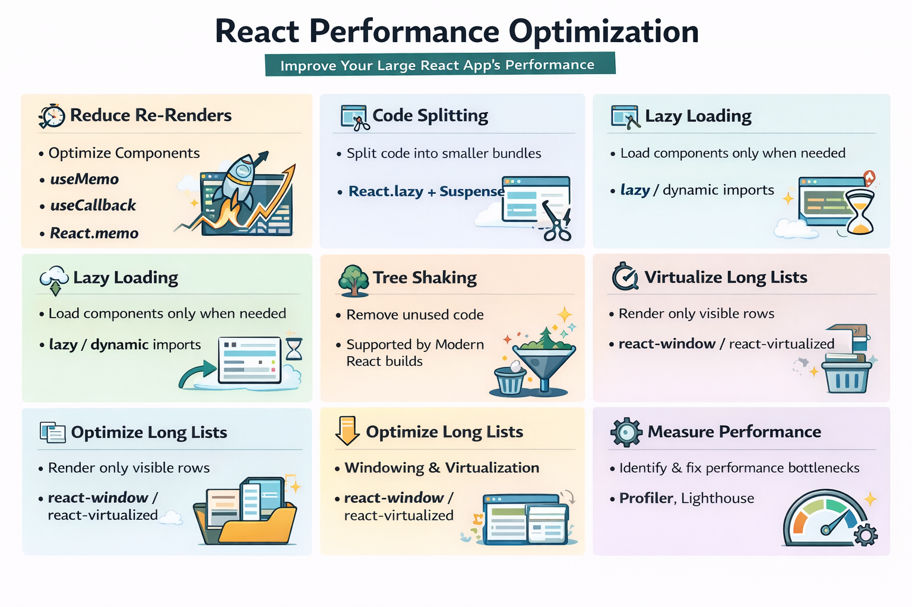

## Model component machine coding round interview
- 1hr


## Todo app
- 1hr


## usedebounce
- 20 min


## Usememo, usecallback, memo use and its optimization
- 40min


=====

Machine Coding Rounds

Build a modal with:

ESC close

Overlay click

Portal

Focus trap

Build a debounced search input

Build pagination component

Build autocomplete dropdown

Build file upload with progress

Build infinite scroll

Build form with validation

Build shopping cart

Build protected routes


```
                      ┌─────────────────────────────┐
                      │        App / Root           │
                      │   (can hold top-level state)│
                      └─────────────┬──────────────┘
                                    │
                      ┌─────────────┴──────────────┐
                      │       Lifting State Up     │
                      │ Parent holds state shared  │
                      │ between multiple children  │
                      └─────────────┬──────────────┘
                                    │
                   ┌────────────────┴─────────────┐
                   │ Shared State passed as props │
                   │ to controlled children       │
                   └─────────────┬───────────────┘
                                 │
        ┌───────────────┐       ┌───────────────┐
        │ Child 1       │       │ Child 2       │
        │ Controlled    │       │ Controlled    │
        │ input / UI    │       │ Preview / UI  │
        └───────────────┘       └───────────────┘

───────────────────────────────────────────────────────────
        Compound Components Pattern
───────────────────────────────────────────────────────────
┌───────────────┐
│ Parent        │  <-- holds internal state (active tab, open dropdown)
│ Tabs / Accordion│
└───────┬───────┘
        │
┌───────┴───────┐
│ Tab / Panel 1 │  <-- receives props from parent (isActive, handlers)
└───────────────┘
┌───────────────┐
│ Tab / Panel 2 │
└───────────────┘

───────────────────────────────────────────────────────────
        Render Props Pattern
───────────────────────────────────────────────────────────
┌────────────────────────────┐
│ MouseTracker / DataFetcher │  <-- holds logic & state
│ children = function(pos)   │
└─────────────┬──────────────┘
              │
┌─────────────┴──────────────┐
│ Custom UI based on state    │  <-- flexible render via function
└────────────────────────────┘

───────────────────────────────────────────────────────────
        Controlled vs Uncontrolled
───────────────────────────────────────────────────────────
Controlled: React owns state
┌─────────────┐
│ Input       │  value={state} onChange={setState}
└─────────────┘

Uncontrolled: DOM owns state
┌─────────────┐
│ Input       │  ref.current.value
└─────────────┘

───────────────────────────────────────────────────────────
        State Colocation
───────────────────────────────────────────────────────────
Keep state closest to component that needs it
┌─────────────┐
│ Component A │  <-- holds own state
└─────────────┘
┌─────────────┐
│ Component B │  <-- unrelated, no re-renders
└─────────────┘

───────────────────────────────────────────────────────────
        Container–Presentational
───────────────────────────────────────────────────────────
┌─────────────┐
│ Container   │  fetches data, holds state, passes props
└─────┬───────┘
      │
┌─────┴───────┐
│ Presentational │ renders UI based on props only
└───────────────┘


```




##

Rendering & Performance 
What causes re-renders in React? 
How to prevent unnecessary re-renders?
 What is React.memo? 
 How does reconciliation work
 ? What is batching in React 18?
  What is Strict Mode? 
  Why does React render twice in dev?






##
Hooks

What are Hooks? Why were they introduced?

Rules of Hooks

Difference between useEffect, useLayoutEffect

How does dependency array work in useEffect?

What happens if you omit dependency array?

How to cleanup effects?

Difference between useRef and useState

When to use useCallback vs useMemo

How does useReducer differ from useState?

Custom Hooks – when and why?





##
Performance & Optimization 
How to optimize a large React app? 
Code splitting in React
 Lazy loading vs dynamic imports 
 Tree shaking – does React support it? 
 How to optimize long lists? 
 Virtualization (react-window / react-virtualized) 
 How to measure performance in React?


